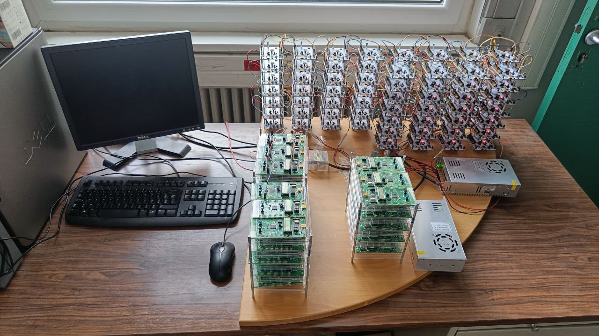

# TIMA SRAM Platform

<figure markdown>
  { width="500" }
</figure>

This section contains information about the SRAM platform that has been deployed and it's currently working at the [TIMA Laboratory](https://tima.univ-grenoble-alpes.fr/) in Grenoble, France. 

The platform is composed of 84 ST nucleo boards and 45 ST discovery boards, composing a total of 129 devices.

<figure markdown>
  { width="800" }
  <figcaption>SRAM Platform using STM32 devices at TIMA Laboratory</figcaption>
</figure>

## Data availability

The data gathered in this station is publicly available online. To request available data, simply click on the following button to be directed to the website. There, you should provide for contact information and you will be able to filter the data. If the data requested is too large, it will be compressed in a zip file before.

[Request data](https://puf4iot.univ-grenoble-alpes.fr){ .md-button}

If the requested data is used within a scientific or technical publication, you are requested to cite the following paper:

> S. Vinagrero, H. Martin, A. de Bignicourt, E.-I. Vatajelu, and G. Di Natale, "SRAM-Based PUF Readouts," Scientific Data 10, 333 (2023). https://doi.org/10.1038/s41597-023-02225-9

[Official publication](https://www.nature.com/articles/s41597-023-02225-9)

## Documentation structure

The following sections explain all the implementation details of this instance.

The code reference for this instance can be found under the `src` folder inside the project. The instance source code documentation can be accesed directly [here](./tima_api.md) while the documentation of the source code of the devices used can be found [here](./device_api.md)
